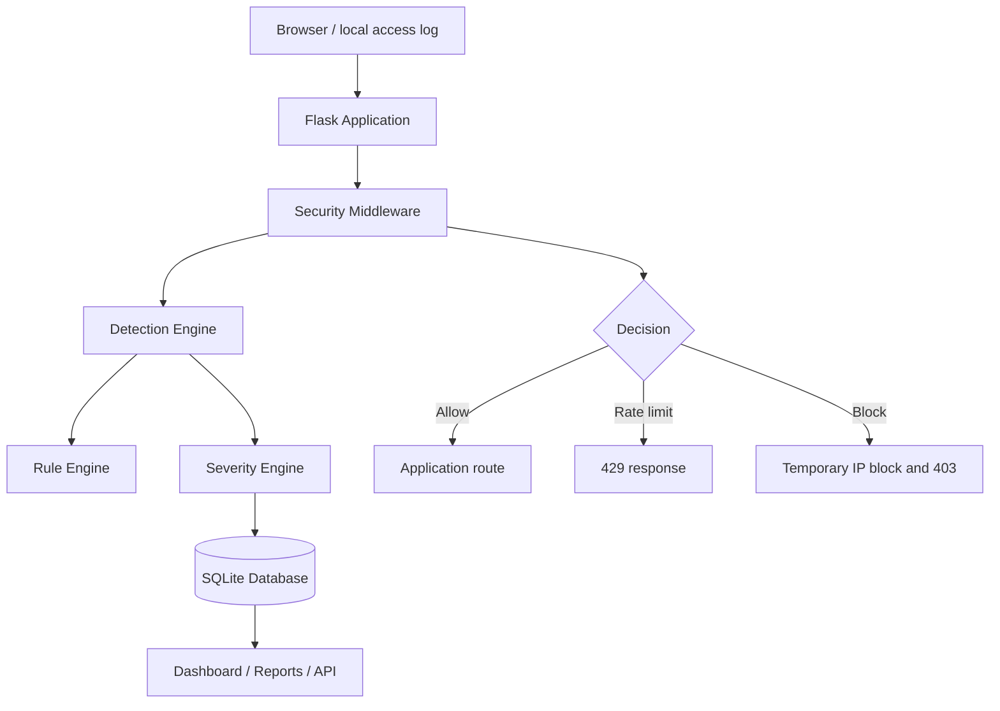
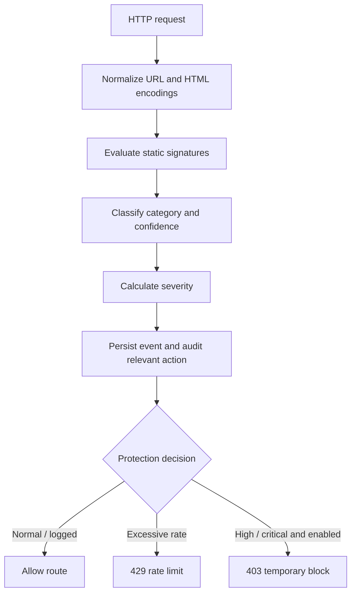
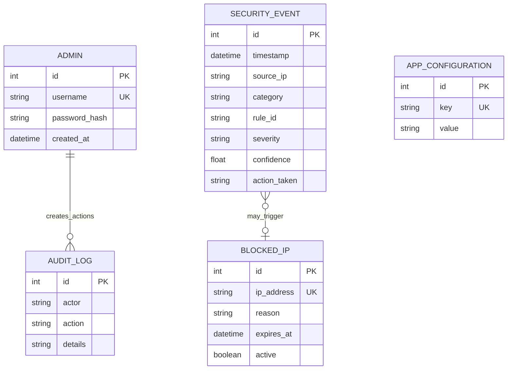

# SentinelShield Project Documentation

## 1. Abstract

SentinelShield is a lightweight web intrusion detection and protection project for cybersecurity students. It analyses HTTP request metadata and local access-log paths with explainable rule-based signatures, stores alerts in SQLite, and presents them through an authenticated dashboard. It demonstrates normalization, detection, severity, logging, and a temporary protective action without implementing exploitation, scanning, or other offensive capability.

## 2. Introduction

Web applications receive malformed and hostile input alongside normal traffic. New learners benefit from a visible local example of how an IDS identifies common input patterns and how a basic web protection layer responds. SentinelShield makes each alert inspectable: it includes a reason, rule ID, confidence, severity, and action.

## 3. Problem Statement

Many small academic applications have no monitoring layer and no convenient way to correlate suspicious requests or repeated login failures. Enterprise products can be expensive and difficult to demonstrate locally. The project provides a functional, safe, low-infrastructure learning implementation.

## 4. Existing System

In a basic Flask application, requests reach routes directly and ordinary server logs are reviewed manually. There is no shared request normalization, classification, central event history, visual triage, temporary protection, or audit record.

## 5. Proposed System

SentinelShield adds Flask middleware before application routes. It examines paths, query parameters, and non-sensitive form values; decodes common encodings; applies static signatures; calculates severity; saves an event; then permits, rate-limits, or blocks the request. An administrator reviews records and manages temporary IP blocks.

## 6. Objectives

- Detect common suspicious web-input indicators safely.
- Correlate repeated failed logins and high request frequency per IP.
- Store explainable evidence without persisting sensitive request contents.
- Provide dashboard, reports, APIs, settings, and an audit trail.
- Remain understandable and runnable on a laptop.

## 7. Scope

The scope is localhost and private academic-lab traffic. It includes static rule matching, SQLite persistence, an in-memory rate store, password-protected administration, and common access-log imports. It excludes attack automation, external scanning, malware, password cracking, distributed deployment, and commercial threat feeds.

## 8. Functional Requirements

1. Inspect web request metadata before business routes process it.
2. Detect SQL injection, XSS, traversal, command-injection indicators, sensitive-path reconnaissance, brute force, and excessive requests.
3. Assign severity and confidence deterministically.
4. Record detections and display them with details.
5. Temporarily block high/critical detections when enabled and rate-limit excessive frequency.
6. Parse supported access logs and import detected events.
7. Authenticate administrators and protect JSON endpoints.
8. Validate bounded configuration values and export CSV reports.

## 9. Non-Functional Requirements

- Python 3.11+ and simple local installation.
- Responsive, readable UI for beginners.
- No plaintext passwords, secrets, cookies, tokens, or request body storage.
- Parameterized ORM database access and bounded uploads.
- Deterministic behaviour suitable for repeatable demonstrations.

## 10. System Architecture



## 11. Data Flow



## 12. Database Design



The event-to-block relationship is logical instead of a foreign key so an IP’s current protective reason remains clear when it produces later events. Configuration and audit entries are independent persistent records.

## 13. Detection Methodology

`RequestDetector` first applies NFKC Unicode normalization, URL decoding, and HTML entity decoding, with a maximum of three decoding passes. It compares bounded text against compiled, source-controlled regular expressions.

| Category | Contextual signals | Typical confidence |
|---|---|---|
| SQL injection | `UNION SELECT`, quoted Boolean tautology, comments, `information_schema` | 0.83–0.95 |
| XSS | Script tag, inline handler, `javascript:` scheme | 0.87–0.96 |
| Traversal | `../` or `..\` after normalization | 0.95 |
| Command injection indicator | Shell separator plus command-like token | 0.88–0.91 |
| Suspicious request | Sensitive configuration/admin path | 0.67 |
| Brute force | Failed-login threshold in a window | 0.92 |
| Excessive requests | Configured per-minute limit exceeded | 0.78 |

A plain word such as `select` does not match. Confidence is the strongest rule score plus a small deterministic bonus for different corroborating categories. Strong evidence is `HIGH`; medium-strength evidence or repeated signals are `MEDIUM`; distinct categories or repeated strong signals become `CRITICAL`. No result is randomly assigned.

## 14. Security Mechanisms

- Werkzeug salted password hashes; no default credential in source.
- Per-session CSRF token for browser and state-changing API requests.
- `HttpOnly`, `SameSite=Lax` cookies and optional secure-only cookie setting.
- CSP, frame-denial, content-type, and referrer headers.
- SQLAlchemy ORM rather than constructed SQL.
- File type, size, and in-memory safeguards for access-log uploads.
- Range-validated settings with fixed sensitivity choices; no web-configured regex/code.
- Exclusion of passwords, tokens, cookies, files, and request bodies from event records.
- Generic 403/429 pages that do not disclose matching internals.

## 15. Implementation

`app.py` creates database tables and registers middleware, blueprints, error pages, rotating logs, and the `init-admin` command. `database/models.py` defines persistent entities. `detection/` contains normalization, rules, confidence/severity, and the thread-safe rate window. `middleware/security_middleware.py` enforces decisions. Blueprints keep dashboard, events, logs, blocks, reports, settings, and Lab concerns separate.

The dashboard queries `SecurityEvent` records at request time. Therefore its cards, charts, top IPs, reports, and event rows are never hardcoded. The bundled log is explicitly labelled as harmless local training data.

## 16. Testing

The pytest suite uses an isolated in-memory SQLite database. It tests normal input, each signature type, confidence and severity calculation, request and login rate detectors, event persistence, 403 blocking, brute-force blocks, sessions, CSRF, headers, core pages, APIs, log importing, and Lab persistence.

Run:

```bash
pytest
```

## 17. Results

On startup with an administrator configured, the application creates the schema and displays an empty but functional dashboard. Processing the bundled log produces four events: SQL injection, XSS, traversal, and command-injection indicators. Each record is explainable and can be exported. High-confidence live patterns create events and optional blocks; request frequency excess produces a generic 429 response.

## 18. Limitations

Static signatures cannot fully understand application context and may produce false positives or miss novel patterns. Rate data is process-local and resets on restart. SQLite and this dashboard are not designed for enterprise concurrency, multi-node correlation, long retention, or production WAF deployment.

## 19. Future Enhancements

Future work could use Redis for distributed counters, real-time log streaming, SIEM forwarding, Elasticsearch search, carefully evaluated anomaly detection, threat-intelligence enrichment, advanced correlation, production proxy deployment, and GeoIP maps. These are intentionally outside the local academic scope.

## 20. Conclusion

SentinelShield demonstrates the defensive monitoring loop in a practical local application: inspect, normalize, detect, classify, record, explain, and protect. The modular design and source-controlled rules support a cybersecurity internship presentation while keeping limitations explicit.

## 21. References

1. OWASP Foundation, *OWASP Top 10: Web Application Security Risks*.
2. OWASP Foundation, *Input Validation Cheat Sheet*.
3. Pallets, *Flask Documentation* and *Werkzeug Security Helpers*.
4. SQLAlchemy, *SQLAlchemy ORM Documentation*.
5. Python Software Foundation, *logging* and *sqlite3* documentation.
