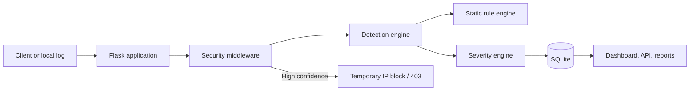

# SentinelShield – Advanced Intrusion Detection & Web Protection System

SentinelShield is a beginner-friendly, defensive Flask application for cybersecurity internships and classroom projects. It inspects local web requests and access-log paths, applies explainable rule-based detections, stores alerts in SQLite, and presents the results through a small SOC-style dashboard.

It is deliberately an academic IDS/web-protection layer—not a scanner, attack tool, or enterprise SIEM. It never executes submitted strings, performs external scanning, or stores passwords in plaintext.

## Problem statement and objectives

Small applications and learners often lack an approachable way to see how suspicious HTTP activity is detected, classified, logged, and mitigated. SentinelShield provides that lifecycle with local-only lab data and transparent rules.

- Detect SQL injection, XSS, path traversal, command-injection indicators, failed-login bursts, excessive requests, and suspicious paths.
- Assign deterministic severity and confidence scores.
- Persist events, blocks, settings, and administrator actions.
- Offer a protected dashboard, API, log analyser, reports, and localhost-only lab.
- Keep the solution readable, inexpensive, and safe to demonstrate.

## Features

- Static signatures with Unicode, URL, and HTML entity normalization.
- Deterministic `LOW`, `MEDIUM`, `HIGH`, and `CRITICAL` severity plus confidence scores.
- Middleware that logs suspicious requests and sends a generic `403` for automatic high-confidence blocks.
- In-memory per-IP request and failed-login behaviour tracking.
- SQLite event history, temporary blocks, configuration, and audit trail.
- Local admin authentication using Werkzeug hashes, secure sessions, CSRF validation, and security headers.
- Dashboard charts calculated from the database, event drill-down, CSV reporting, and access-log import.
- Localhost-only lab for harmless strings; it analyses but never executes submitted input.
- pytest coverage for detectors, protection flows, authentication, API, and persistence.

## Architecture



## Technology stack

| Component | Choice | Purpose |
|---|---|---|
| Backend | Python 3.11+ and Flask | Readable local web application |
| Database | SQLite and Flask-SQLAlchemy | Persistent events without extra infrastructure |
| Security | Werkzeug | Password hashing and session primitives |
| UI | Bootstrap 5, CSS, Chart.js | Responsive SOC-style screens and charts |
| Tests | pytest | Automated functional validation |

## Installation

```bash
git clone <your-repository-url>
cd SentinelShield
python -m venv venv
```

Activate the environment:

```bash
# macOS / Linux
source venv/bin/activate

# Windows PowerShell
venv\Scripts\Activate.ps1

# Windows Command Prompt
venv\Scripts\activate.bat
```

Install dependencies, create the first administrator, and run the application:

```bash
pip install -r requirements.txt
flask --app app init-admin
python app.py
```

Open [http://127.0.0.1:5000](http://127.0.0.1:5000). SQLite schema and default security settings are created automatically on the first run.

### Alternative first-run admin setup

Copy `.env.example` to `.env`, use a long random `SECRET_KEY`, then set both `ADMIN_USERNAME` and `ADMIN_PASSWORD` before starting once. The CLI command is preferable because it does not leave a password in an environment file. Never commit `.env`.

## Usage

1. Sign in with the local admin you created.
2. Visit **Log Analysis** and process `sample_data/sample_access.log` to create harmless sample detections.
3. Inspect **Security Events** and select a row for its rule explanation and action.
4. Review temporary blocks, adjust thresholds in **Settings**, or download a CSV report.

Dashboard cards and charts begin empty because they read actual database data rather than hardcoded demonstration values.

## Safe demonstration

Use only localhost or the included private-lab log data.

1. Open **Local Lab** while using `127.0.0.1`.
2. Submit non-executed training strings such as:
   - `training UNION SELECT marker` — SQL injection indicator
   - `<script>training</script>` — XSS indicator
   - `../../training-file` — traversal indicator
   - `check=;whoami` — command-injection indicator
3. The result is logged and explained; the Lab never executes its input.
4. To demonstrate real middleware blocking in a disposable local browser session, request `/?q=training%20UNION%20SELECT%20marker`. SentinelShield returns `403`, logs the event, and creates a temporary block. If it is your own local IP, visit `/blocked-ips` while signed in to remove the demo block.
5. Submit five invalid login attempts within the configured window to demonstrate a `Brute Force` event. Do this only in the local lab.
6. Temporarily lower the requests-per-minute setting and refresh a harmless page until a generic `429` response appears; restore the setting afterwards.

## Detection approach

Input is Unicode-normalized and URL/HTML-decoded up to three passes. Rules require contextual combinations: for example, `UNION SELECT`, quoted Boolean tautologies, or SQL comments—not a plain word such as `select`. Strong signatures score about `0.80–0.96`; lower-confidence sensitive-path reconnaissance scores `0.67`. Multiple independent categories raise confidence and can become `CRITICAL`.

The sensitivity setting controls whether lower-confidence reconnaissance signatures are included and slightly raises cautious scoring in sensitive mode. Rules are source controlled, never editable from the web UI, so an administrator cannot inject arbitrary regex or code.

## API

All API routes require an authenticated local-admin session. State-changing API calls also need an `X-CSRFToken` header containing the session token.

| Method | Endpoint | Description |
|---|---|---|
| `GET` | `/api/events` | Latest persisted events (`?limit=1..200`) |
| `GET` | `/api/events/<id>` | One detailed event |
| `GET` | `/api/statistics` | Dashboard aggregates |
| `GET` | `/api/blocked-ips` | Temporary block records |
| `POST` | `/api/blocked-ips/<ip>/unblock` | Remove an existing block |

## Testing

```bash
pytest
```

Tests use an in-memory SQLite database and cover signatures, severity and confidence, rate detection, database events, request blocking, brute-force tracking, authentication, CSRF, headers, routes, APIs, log import, and the local lab.

## Project structure

```text
app.py                     Application factory and CLI setup
config.py                  Environment and safe defaults
database/                  ORM setup and models
detection/                 Rules, normalization, severity, rate tracking
middleware/                Request inspection, blocks, headers, audit helpers
routes/                    Focused Flask blueprints
templates/ static/         Bootstrap UI, CSS, and dashboard charts
sample_data/               Harmless common-format access log
tests/                     pytest suite
```

## Limitations

- This is a single-process, rule-based academic IDS and can produce false positives and false negatives.
- Request and failed-login tracking is in memory; restarting the app resets it and workers do not share it.
- It does not replace a managed WAF, SIEM, EDR, security review, or production reverse-proxy design.
- SQLite suits local demos and small labs, not concurrent enterprise workloads.
- The Local Lab is disabled when `LAB_MODE=false`; it is not an attack simulator.

## Future improvements

Candidate improvements are Redis-backed distributed rate tracking, SIEM/event streaming, Elasticsearch search, threat-intelligence enrichment, advanced event correlation, production proxy deployment, GeoIP visualisation, and carefully evaluated ML-assisted anomaly detection.

## Security notes

Passwords are hashed with Werkzeug; request bodies, cookies, tokens, and passwords are deliberately excluded from security-event records and application logs. Sessions use `HttpOnly` and `SameSite=Lax`; set `SESSION_COOKIE_SECURE=true` behind HTTPS. Headers include CSP, `X-Frame-Options`, `X-Content-Type-Options`, and `Referrer-Policy`.
